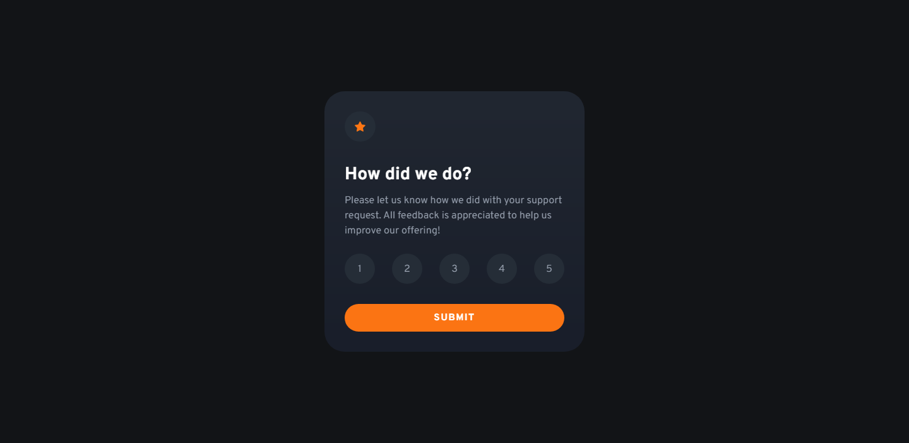

# Frontend Mentor - Interactive rating component solution

This is a solution to the [Interactive rating component challenge on Frontend Mentor](https://www.frontendmentor.io/challenges/interactive-rating-component-koxpeBUmI). Frontend Mentor challenges help you improve your coding skills by building realistic projects. 

## Table of contents

- [Overview](#overview)
  - [The challenge](#the-challenge)
  - [Screenshot](#screenshot)
  - [Links](#links)
- [My process](#my-process)
  - [Built with](#built-with)
  - [What I learned](#what-i-learned)
  - [Continued development](#continued-development)
  - [Useful resources](#useful-resources)
- [Author](#author)

## Overview

### The challenge

Users should be able to:

- View the optimal layout for the app depending on their device's screen size
- See hover states for all interactive elements on the page
- Select and submit a number rating
- See the "Thank you" card state after submitting a rating

### Screenshot



### Links

- HTML solution URL: [HTML](https://github.com/JustANipple/interactive-rating-component/blob/master/index.html)
- CSS solution URL: [CSS](https://github.com/JustANipple/interactive-rating-component/blob/master/style.css)
- JS solution URL: [JS](https://github.com/JustANipple/interactive-rating-component/blob/master/script.js)
- Live Site URL: [LIVE](https://justanipple.github.io/interactive-rating-component/)

## My process

### Built with

- Semantic HTML5 markup
- CSS custom properties
- Flexbox
- CSS Grid
- Mobile-first workflow
- Josh's Custom CSS Reset
- JavaScript

### What I learned

I was trying to make the challenge as maintainable as possible, so i had to find a way to store custom properties into my script.js. I discovered that i can save the root element to retrieve the property values

```js
const rootStyles = window.getComputedStyle(document.documentElement);
const whiteClr = rootStyles.getPropertyValue("--h-clr");
const numBgClr = rootStyles.getPropertyValue("--par-clr");
const orangeClr = rootStyles.getPropertyValue("--btn-clr");
const blueClr = rootStyles.getPropertyValue("--cont-bg-clr");
```

With queryselectorall, i managed to save all the buttons in one line and then i transferred them into an array to loop through them

```js
const buttons = document.querySelectorAll(".rating-nums button");
const btnArray = Array.from(buttons);
```

The transition from mobile view to desktop view wasn't that smooth and didn't look so responsive, so i found a way to transition all the elements selecting the outer container and applying a transition to it:

```css
.container,
.container * {
    transition: ease all .3s;
}
```

It would be pointless to submit if you didn't select any number, so i deactivated it with a CSS rule and then unlock it in JS

Locking it:
```css
.submit-btn {
    pointer-events: none;
}
```

Unlocking it on number click:
```js
function clicked() {
    submit.style.pointerEvents = "unset";
    submit.style.backgroundColor = orangeClr;
}
```

To make the block change, i defined the display rule to change when the submit button is clicked:

```css
.thank {
    display: none;
}
```

```js
submit.addEventListener("click", (event) => {
    selected.textContent = "You selected " + num + " out of 5";
    rating.style.display = "none";
    thank.style.display = "flex";
});
```

### Continued development

The use of event listeners is improvable, so i will to work on that

### Useful resources

- [Root element](https://developer.mozilla.org/en-US/docs/Web/API/Document/rootElement) - This helped me to save the root element to access custom properties i needed
- [Events list](https://dbchung3.medium.com/add-event-listener-dom-event-types-6c10a844c9d8) - I didn't know how the events were named, so i checked this list that helped a lot

## Author

- Frontend Mentor - [@JustANipple](https://www.frontendmentor.io/profile/JustANipple)
